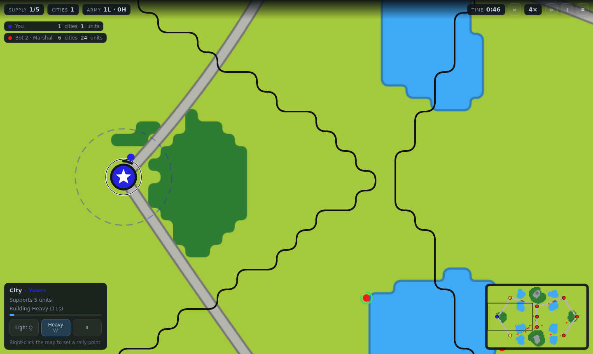

# War of Dots

A minimalist single-player real-time strategy game. Two unit types, cities that
feed your army, and bots that fight back. No build, no dependencies, no assets —
plain ES modules and a `<canvas>`.



## Running it

The game uses ES modules, so the browser will refuse to load it from a `file://`
path — double-clicking `index.html` does not work. It has to be served over HTTP,
which is one command:

```bash
npm start          # serves ./game on http://localhost:8080
```

Any static server will do. On macOS, if you would rather not use Node:

```bash
python3 -m http.server 8080 --directory game
```

Then open <http://localhost:8080>. Stop the server with `Ctrl+C`.

> On a clean macOS install the first `python3` call opens a prompt to install the
> Xcode Command Line Tools. If you would rather skip that, use `npm start`, which
> only needs Node.

Nothing needs to be built or installed to play — the `npm install` step is only
required for the test and tuning scripts below.

## The rules, in full

* **Cities build units on their own.** You only choose *what* each city builds.
* **Each city supports 5 units.** Go over the cap and your troops furthest from
  a friendly city starve to death. Expansion is the only way to a bigger army.
* **Capture a city** by standing inside its ring while no defender is there.
  More units capture faster, up to four. Contest it and the progress bleeds away.
* **Units inside a friendly city's ring heal.** Pull damaged troops back.
* **You win** when every rival has no cities and no units left.

### The two units

| | Light | Heavy |
|---|---|---|
| HP | 42 | 165 |
| Damage | 7.5/s | 27/s |
| Range | 30 | 40 |
| Speed | 68 | 44 |
| Build time | 4.5s | 11s |
| In rough terrain | 0.85× speed, **0.8× damage taken** | 0.42× speed, 0.35× damage, **1.35× damage taken** |

Light wins through numbers and doesn't care about terrain — it even takes cover
in the rough. Heavy is a battering ram that only works in the open: in forests it
crawls, barely scratches anything, and dies fast. Heavies also path *around*
rough ground rather than through it.

On screen: light is a plain dot, heavy wears a thick black ring.

### The ground

| | Passable | Notes |
|---|---|---|
| Plains (light green) | yes | Open ground. Everything works, heavies best of all. |
| Forest (dark green) | yes | Rough: heavies crawl and barely hurt anything, light takes cover. |
| Hills (grey) | yes | Rough, and slightly slow for everyone. |
| Water (blue) | **no** | Only crossable by bridge. |
| Mountain (dark grey) | **no** | Solid. |
| Road / bridge | yes | 1.35× / 1.25× marching speed. Pathing prefers them. |

Roads are generated per map as a minimum spanning tree over the cities, and turn
into bridges wherever they cross water.

The black line on the map is the **front**: every point belongs to whoever owns
the nearest city, and the line is the boundary between two owners. Cities are
discs; a player's starting city is a star.

## Controls

| Input | Action |
|---|---|
| Left click / drag | Select · double-click selects all of that type on screen |
| Right click | Move, or attack the unit under the cursor |
| `A` | Attack-move · `S` stop · `H` hold · `Z` select whole army |
| `Q` / `W` | Build light / heavy in the selected city · `E` pauses its production |
| Right click with a city selected | Set its rally point |
| `Tab` | Cycle your cities · `F` centre on selection · `Ctrl`+`1..9` control groups |
| Arrows / screen edge / middle-drag | Pan · wheel to zoom · `Space` pause · `Esc` menu |

### On a phone

The whole game is playable with one thumb. Drag to pan, pinch to zoom, tap a unit
or city to select it, tap the ground to move there. Five large buttons sit along
the bottom:

* **Pan / Select** — flips dragging between moving the camera and drawing a
  selection box. A phone has no modifier keys, so this is an explicit mode.
* **Attack** — makes the next tap an attack-move. A long press does the same
  thing without the button.
* **All**, **Stop**, **Hold** — select the whole army, halt, or dig in.

The opening zoom is chosen from the viewport, so a phone starts with a usable
slice of map rather than the desktop framing. The HUD collapses to one row on
narrow screens, and the game pauses itself when the tab goes to the background.

## Modes

* **Skirmish** — 1v1, free-for-all, 2v2 with a bot ally, or 1-vs-everyone, on
  five hand-built maps.
* **Bot skill** — Recruit, Officer, Marshal. The tiers are verified to actually
  rank (see below), not just labelled differently.
* **Map editor** — paint plains, forest, hills, mountains and water, place
  cities, save to local storage, play it.
* **Replays** — every finished match is recorded and can be replayed, scrubbed
  and re-watched. The simulation is deterministic, so a replay is just the seed
  plus the command log.

## Project layout

```
game/
  index.html          screens, HUD, overlays
  style.css
  src/
    config.js         all balance numbers and the terrain table live here
    game.js           the simulation: combat, capture, supply, production
    ai.js             bot controller — issues the same commands a human does
    pathfinder.js     A* over the terrain grid, with per-unit-type terrain costs
    terrain.js        terrain grid, blob generation, roads, run-length encoding
    contour.js        cell grid -> smooth outlines (terrain shapes, front lines)
    territory.js      who owns which ground, and the border between owners
    menu-demo.js      the live bot match behind the title screen
    maps.js           the built-in maps
    entities.js       Unit and City
    session.js        one match: loop, camera, HUD, result
    input.js          mouse, keyboard and touch
    render.js         canvas drawing, baked terrain, minimap
    replay.js         record / play back / scrub
    editor.js         map editor
    storage.js        localStorage that tolerates sandboxed iframes
    platform.js       optional CrazyGames SDK, no-ops when absent
    main.js           screens and wiring
```

### Determinism

The simulation never calls `Math.random()`. It runs on a seeded PRNG at a fixed
60 Hz timestep, and cosmetic effects draw from a *separate* stream so that
turning them off can never change a match outcome. Bots have their own RNG for
the same reason: replays run with no AI at all, and any shared draw would desync
the whole match. `npm test` asserts a replayed match reproduces its original
byte-for-byte.

## Tools

These need Playwright, which is resolved from a local install or the global npm
root — no `NODE_PATH` juggling:

```bash
npm install -D playwright && npx playwright install chromium
```

```bash
npm test            # headless smoke test: 24 checks incl. replay determinism
npm run shots       # the same run, writing screenshots/
npm run balance     # bot-vs-bot matches: match length + difficulty ordering
npm run tune        # A/B one AI parameter at a time against a baseline
npm run tune:units  # heavy-leaning bot vs all-light bot, same tactics
npm run build       # dist/war-of-dots.zip, ready to upload
```

`tune.mjs` and `tune-units.mjs` are how the current numbers were arrived at, and
they have earned their keep twice:

* The first pass had the difficulty tiers *inverted* — "Marshal" lost to
  "Recruit" 7 times out of 9 — and heavies at a 19% win rate against an
  all-light bot with identical tactics.
* Adding roads and mountains silently changed which tactics win. Two levers
  flipped sign (steering around defended cities went from a liability to an
  advantage) and heavies fell back to 28%. The tiers had quietly collapsed to
  hard-beats-normal 60% before the sweep caught it.

Neither regression was visible from reading the code. Re-run `npm run tune` and
`npm run tune:units` after any change to terrain, unit stats or maps.

Current state: hard beats normal 22/30, hard beats easy 28/30, normal beats easy
27/30, and a heavy-leaning bot beats an all-light bot 56% of the time.

## Packaging for a portal

`npm run build` produces `dist/war-of-dots.zip` with `index.html` at the root,
which is what CrazyGames expects. Everything is relative-path and self-contained,
the canvas is responsive down to phone widths, touch controls are enabled
automatically, and the game auto-pauses when the tab is hidden.

`src/platform.js` will load the CrazyGames SDK and report gameplay start/stop and
loading events *if* the game is running inside an iframe and the SDK is
reachable. If it isn't, every call quietly does nothing and the game plays
exactly the same.

## Screenshots

The images in `screenshots/` are generated from this build by `npm run shots`.
